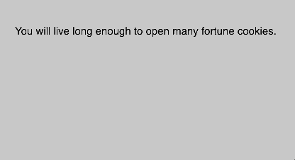

# Arrays and `floor`

Arrays are incredibly powerful programming tools because they allow us to store many values in a single variable. As we discussed last time we could create an array of colors like:

```javascript
var colors = ["red", "green", "blue", "yellow"]
```

We then could access a given value using their index like:

```javascript
fill(colors[1])
//The fill is set to green
```

Today we will be using arrays to increase the complexity of our program. Additionally, we will be using `floor` in combination with `random`. `floor` allows for numebrs to be rounded down to the nearest whole number. This is particularly useful when used with `random` because random returns a decimal value and index values need to be whole numbers.

```javascript
var num = random(0,10)
console.log(floor(num))
//Prints out a number between 0 and 9
```

Use the information provided above in adition to the information on the slides to complete your work for the day.

## Tasks

1. **CHALLENGE #1**: Create an array of named colors at the top of your program on script.js. Your list should have at least 6 different colors. Using indexes, fill in rectangles with the colors that are stored on the list similar to the image below. Draw an image with 6 rectangles stacked on top of one another


2. **CHALLENGE #2**: Make an array of numbers. Color your rectangles using rgb value rather than named colors. You should use the numbers in your array as the values in the new image.


3. **CHALLENGE #3**: In function setup(), create two variables to store a random color in your color list. Use these colors to fill the shapes in the draw loop. Every time the program runs, you should get a shape with a random color. Two example runs are shown below.


4. **CHALLENGE #4**: Pick 10 fortune cookie messages from this [list](https://quotes.yourdictionary.com/articles/funny-fortune-cookie-sayings.html). Store them in an array. Whenever the user loads the sketch, a different text message will be displayed.



5. **CHALLENGE #5**: Create a program that randomly pairs students in your class in a group project.

6. **CHALLENGE #6**: Make your last program interactive. Update or modify the groups whenever you click, or press a key.
